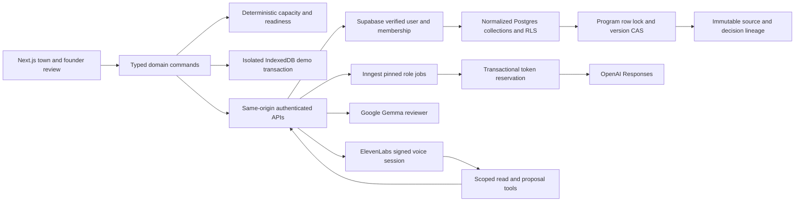

# Architecture and trust boundaries

Source notes are untrusted data. Model output cannot authorize a commitment or fabricate a measured event. AI writes validated proposals; founder commands own state transitions. Three call slots and bounded packets limit provider admission. Version mismatch quarantines stale results. Current result/event APIs support snapshot plus sequence-cursor recovery.

Database migrations store separate programs, memberships, partners, sources, requests, work, agreements, promises, observations, scenarios, decisions, runs, reviews, proposals and history collections. Core lookup IDs and version columns are relational; entity payloads are strictly validated by shared Zod schemas before server writes. There is no generic unvalidated entity bucket and no direct authenticated write policy.

The only service-role access is in server modules. Membership is rechecked for provider, export/share and voice access. Public shares are random-token, hashed-at-rest, redacted snapshots with expiry/revocation. Invitation acceptance checks the current verified email and consumes a token under a lock.

The local PGlite migration tests validate SQL behavior in an embedded PostgreSQL engine; they do not establish a deployed Supabase configuration or multi-browser OAuth acceptance.
